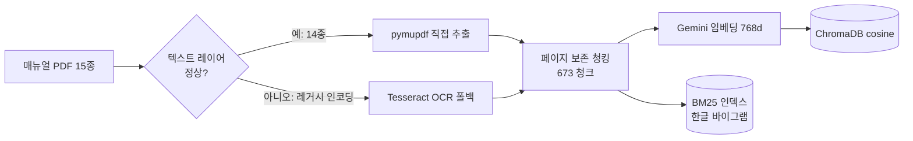
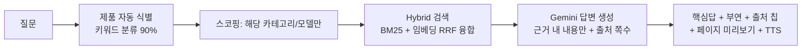

# 매뉴얼 음성 도우미 (manualgo) 🎙️

> **"세탁기 예약은 최대 몇 시간까지 돼?"** — 폰에 대고 물으면, 매뉴얼을 검색해
> **근거 페이지와 함께** 음성으로 답하는 핸즈프리 RAG 시스템

가전이 갑자기 멈추면 사람들은 수십 쪽짜리 PDF 매뉴얼 대신 폰을 듭니다.
이 프로젝트는 그 순간 — *양손은 기기를 만지고 있고, 답은 매뉴얼 어딘가에 있는* — 을 위해 만들었습니다.

매뉴얼은 **"이 질문의 정답은 몇 페이지"가 명확한 도메인**입니다.
그래서 이 프로젝트의 핵심은 챗봇 그 자체가 아니라, **검색 품질을 수치로 진단하고 → 개선하고 → 재측정하는 루프**입니다.

---

## 📊 핵심 결과 한눈에

| 지표 | 결과 | 비고 |
|---|---|---|
| 검색 정확도 (제품 식별 시) | **R@1 0.77 · R@5 0.97 · MRR 0.86** | 151문항, (매뉴얼, 페이지) 단위 정답 |
| 검색기 개선 폭 | Naive 0.40 → **Hybrid 0.50 (+24%)** → 매뉴얼 스코핑 0.77 | 동일 평가셋, R@1 기준 |
| 제품 자동 식별 (Agentic) | **136/151 (90%)** | 키워드 분류 — 필터 충돌·에어컨 오라벨 15건 |
| 리랭커 A/B (ONNX 크로스인코더) | 방향성 +4~6pp이나 **n=151에서 미유의** (McNemar p≥0.19) | +8.4s/질문(CPU) → 라이브 미탑재 판단 |
| 환각률 (LLM-as-judge) | **0/7 검출** · 인용 정확 7/7 | 소표본 스폿체크 |
| 코퍼스 | 매뉴얼 15종 · 673청크 (~570쪽) | LG 14 + 삼성 1, 7개 카테고리 |

---

## 데모 흐름

```
 제품 선택(칩)  →  🎙️ 음성 질문  →  근거 검색  →  핵심 답 + 출처 칩  →  📄 출처 페이지 미리보기
 (안 골라도 됨:      브라우저 STT       Hybrid+스코핑     "최대 24시간"          실제 매뉴얼 페이지가
  질문에서 자동 식별)                                  + Azure 음성 재생        그대로 뜸 + 탭하면 확대
```

- **출처가 UI의 중심**입니다 — 답변마다 근거 페이지 번호 칩이 붙고, 탭하면 실제 매뉴얼
  페이지 이미지가 바텀시트로 올라옵니다. *환각인지 아닌지 사용자가 직접 검증할 수 있습니다.*
- STT는 브라우저 Web Speech(무료·클라이언트), TTS는 Azure 뉴럴 보이스(폴백: 브라우저 TTS).

---

## 아키텍처

**① 오프라인 인덱싱 (사전 1회)**



**② 온라인 추론 (질문마다)**



---

## 🔬 엔지니어링 스토리 — 진단 → 개선 → 재측정

이 프로젝트에서 가장 공들인 부분입니다. 모든 개선은 **같은 평가셋으로 전후를 측정**해 입증했습니다.

### 1. 현실의 PDF는 깨져 있었다 → 파서 우선 + OCR 자동 폴백

수집한 매뉴얼 중 삼성 구형 PDF는 레거시 한국어 인코딩(KSCpc-EUC)이라 텍스트 추출 시
`쟔뫎럎뫐` 같은 깨진 글자만 나왔습니다. **텍스트 레이어 정상 여부를 자동 감지**해
정상이면 직접 추출, 깨졌으면 Tesseract OCR로 폴백하는 인제스트를 만들었습니다.

| (동일 평가셋) | OCR 전용 | 파서 우선 |
|---|---|---|
| 사양·수치형 R@1 | 0.263 | **0.368** |
| 사양·수치형 R@5 | 0.579 | **0.789** |
| 전체 R@5 | 0.705 | **0.818** |

→ OCR 숫자 노이즈(`24시간→7시간`)가 수치형 질문을 망친다는 가설이 수치로 확인됐습니다.

### 2. 검색기 3단계 비교 — 융합이 단독을 이긴다

| 검색기 (R@1 / MRR) | 결과 | 관찰 |
|---|---|---|
| Naive (임베딩 단독) | 0.404 / 0.585 | 베이스라인 |
| BM25 (키워드 단독) | 0.457 / 0.592 | 문제해결·에러코드형에서 임베딩 능가 |
| **Hybrid (RRF 융합)** | **0.503 / 0.654** | **전체 1위 (Naive 대비 +24%)** |

임베딩과 BM25는 서로 다른 유형에서 강했고(임베딩=사양·사용법, BM25=문제해결·에러코드),
RRF 융합이 **두 검색기의 강점만 취해** 전체 R@1에서 단독을 앞섰습니다.
*(151문항, 글로벌 스코프 — 세 검색기를 같은 조건에서 비교한 수치입니다.)*

### 3. 실패 클러스터링 → "교차-매뉴얼 혼동" 발견 → 스코핑으로 해결

점수만 내지 않고 **틀린 질문을 유형별로 클러스터링**했습니다. 주요 실패 모드:
보증·부품보유기간 같은 **법정 고지 문구가 매뉴얼마다 거의 동일**해서, 맞는 *종류*의
페이지를 **틀린 매뉴얼**에서 가져오는 것. → 검색을 제품 단위로 좁히는 **스코핑**을 구현했습니다.

| Hybrid (151문항) | R@1 | R@5 | MRR |
|---|---|---|---|
| 글로벌 (스코핑 없음) | 0.503 | 0.874 | 0.654 |
| 카테고리 스코핑 | 0.497 | 0.887 | 0.655 |
| **매뉴얼 스코핑 (제품 식별 시)** | **0.768** | **0.974** | **0.859** |

→ **정확한 제품을 알 때(매뉴얼 스코핑) R@1이 0.50→0.77로 도약**합니다 — 핵심 검색은 강했고,
낮은 글로벌 수치는 교차-매뉴얼 혼동 탓이었습니다. 다만 평가셋을 3배로 늘리자
**카테고리 수준 스코핑만으론 R@1 회수가 거의 없어**(0.497 ≈ 글로벌 0.503; R@5만 +1.3pp),
관건은 *카테고리 추정*이 아니라 *정확한 제품 식별*임이 드러났습니다.
그래서 UI는 제품 칩 탭(→ 매뉴얼 스코핑 0.77)을 1급 경로로 두고, 칩을 안 고르면
Agentic이 질문에서 카테고리를 자동 분류(136/151, **90%**)해 글로벌 수준으로 대응합니다.
*(52문항 땐 100%였지만, 확장 평가셋에서 `필터` 키워드 충돌·에어컨 오라벨 15건이 드러났습니다.)*

### 4. 평가 인플레를 스스로 발견하고 수치를 깎았다

초기 자동 생성 평가셋은 본문이 긴 페이지를 선호해 **보증/보상 페이지 질문이 과대표집**돼
있었고, 점수가 부풀려져 있었습니다(스코핑 R@1 0.82). 보일러플레이트 제외 + 페이지 분산
샘플링으로 재생성하자 **0.71로 내려갔고, 이쪽이 정직한 수치**입니다.
*좋아 보이는 숫자보다 신뢰할 수 있는 숫자를 선택했습니다.*
(이후 검정력 확보를 위해 같은 원칙으로 평가셋을 **151문항**까지 확장했습니다 → §6.)

### 5. 답변 품질 — 검색만이 아니라 생성도 측정

LLM-as-judge로 실서비스 경로의 답변을 3축 채점했습니다 (충실성 / 인용 정확성 / 정답성).

- **환각 0/7 검출, 인용 정확 7/7**, 정답 페이지 일치 5/7
- "오답" 2건도 지어낸 것이 아니라 **근거는 있으나 쌍둥이 모델의 매뉴얼 기반** —
  실패 클러스터링에서 발견한 코퍼스 모호성이 답변 레벨에서 재확인된 것

> ⚠️ 소표본(n=7) 스폿체크이며 심판이 생성기와 같은 모델 계열입니다.
> "환각 0% 확정"이 아니라 "7건에서 미검출"이 정확한 표현입니다.

### 6. 최고 레버리지 후보(리랭커)를 붙이고, 통계가 배포를 말렸다

top-1 정밀도를 끌어올릴 가장 큰 레버는 **Cross-Encoder Reranker**입니다. Windows torch
크래시 제약을 **ONNX(onnxruntime + tokenizers)** 로 우회해 `bge-reranker-v2-m3`를 붙이고,
Hybrid 상위 후보를 (질문, 청크) 쌍으로 재정렬했습니다. 그리고 **"붙였다"로 끝내지 않고**
같은 평가셋으로 전후를 측정했습니다.

| A/B (151문항) | R@1 | Δ | 95% CI (paired bootstrap) | McNemar |
|---|---|---|---|---|
| 매뉴얼 스코핑 | 0.768 → **0.808** | +4.0pp | [−0.026, +0.106] | p=0.33 |
| 카테고리 스코핑 | 0.497 → **0.556** | +6.0pp | [−0.020, +0.146] | p=0.21 |
| Agentic (자동) | 0.470 → **0.530** | +6.0pp | [−0.020, +0.139] | p=0.19 |

리랭커는 **전 스코프에서 방향성 이득**(R@1 +4~6pp)을 보였지만, **모든 신뢰구간이 0을 포함**하고
McNemar p ≥ 0.19 — 이 개선은 **표본 노이즈와 통계적으로 구별되지 않습니다.**

> **왜 이게 좋은 결과인가.** 초기 52문항에선 R@1 **+9.6pp**에 리랭커 승률 78%로, 점추정만 보면
> "채택!"이라 쓸 뻔했습니다. 하지만 평가셋을 151문항으로 늘리자 승률이 **62%로 평균 회귀**하고
> 이득은 절반으로 줄었습니다 — *작은 표본의 화려한 숫자는 신기루였던 것.* 부트스트랩 CI와
> 검정력 분석(`compare.py`·`report.py`)이 그 함정을 잡아냈습니다. 이 효과크기를 80% 검출력으로
> 확증하려면 **540~850문항**이 필요합니다.

**엔지니어링 판단**: 이득은 작고 불확실한데 비용은 확실합니다 — CPU int8 재정렬이
**질문당 +8.4초**(단일 쿼리 실측)로 음성 UX엔 치명적. 그래서 리랭커는 **라이브 경로에 넣지 않고**
오프라인 평가·GPU 배포용으로 분리하고, 라이브는 빠른 Agentic 스코핑을 유지했습니다.
*가장 큰 레버를 당겨보고, 내 통계가 "아직 배포하지 마라"고 하면 그 말을 따르는 것 — 그게 측정 루프의 목적입니다.*

---

## 기술 스택 (실제 사용)

| 영역 | 기술 | 선택 이유 |
|---|---|---|
| 문서 처리 | PyMuPDF + Tesseract(kor) | 텍스트 레이어 자동 감지, 깨지면 OCR 폴백 |
| 임베딩 | Gemini `embedding-001` (768d) | Windows에서 torch 스택이 크래시 → API로 우회 |
| 키워드 검색 | rank-bm25 + **한글 바이그램 토크나이저** | 띄어쓰기 없는 추출 텍스트 대응 |
| 융합 | Reciprocal Rank Fusion (k=60) | 점수 정규화 불필요, 안정적 |
| 재순위 (오프라인) | ONNX `bge-reranker-v2-m3` | torch 우회 크로스인코더 — A/B로 오프라인 판단(8.4s/질문) |
| 벡터 DB | ChromaDB (cosine, 영속) | 메타 필터로 스코핑 (`manual_id $in`) |
| LLM | Gemini 2.5 Flash | 근거 제한 프롬프트 + JSON 구조화 답변 |
| STT / TTS | 브라우저 Web Speech / **Azure Speech** (REST) | 클라이언트 STT 무료, TTS는 뉴럴 보이스+폴백 |
| 백엔드 / 프론트 | FastAPI / Vanilla JS (모바일 우선) | `/ask` `/manuals` `/tts` `/page` |

**제약 대응기**: 이 프로젝트는 Windows + 6GB GPU + 무료 API 쿼터라는 제약에서 만들어졌습니다.
`sentence-transformers` import가 무음 크래시 → 임베딩을 API로 전환, Gemini 무료
`generate_content` 20회/일 → OCR을 로컬 Tesseract로 이전하고 평가는 임베딩 쿼터(별도)만
쓰도록 설계, 대량 호출엔 백오프·재시도·부분저장·이어하기를 붙였습니다.
리랭커도 같은 torch 제약을 ONNX로 우회했고, 반복되는 평가셋 쿼리는 키별 **디스크 임베딩
캐시**(`EMBED_CACHE`)로 1회만 호출합니다(6구성 재검정 시 906→151회).

---

## 실행 방법

```bash
# 0. 사전 준비: Python 3.11, Tesseract(한국어 데이터 포함) 설치
pip install -r requirements.txt
pip install -e .

# 1. 환경 변수
cp .env.example .env       # GOOGLE_API_KEY, TESSERACT_CMD, AZURE_SPEECH_* 채우기

# 2. 매뉴얼 수집 + 인덱스 구축 (사전 1회)
python scripts/collect_manuals.py          # data/raw/manual_urls.txt 의 직링크 다운로드
python -m rag.indexing.build_index         # 파싱(파서/OCR 자동) → 임베딩 → ChromaDB

# 3. 웹앱 실행 → Chrome에서 http://localhost:8000
uvicorn backend.main:app --reload

# 4. 평가 (포트폴리오 핵심)
python -m evaluation.generate_evalset --append   # 평가셋 증분 확장(배치 생성) + scripts/review_evalset.py
export EMBED_CACHE=1                              # 반복 쿼리 임베딩 캐시 (PowerShell: $env:EMBED_CACHE=1)
python -m evaluation.run_eval hybrid manual      # Recall@k·MRR [naive|bm25|hybrid|agentic|rerank|agentic-rerank] [manual|category]
python -m evaluation.compare hybrid_manual rerank_manual   # A/B 유의성 (paired bootstrap·McNemar)
python -m evaluation.report                      # 통합표 + 3쌍 A/B + 필요 표본 크기(검정력)
python -m evaluation.failure_clustering          # 실패 유형 분석
python -m evaluation.answer_quality 8            # 환각률·인용 정확성 (LLM-as-judge)
```

---

## 프로젝트 구조

```
manualgo/
├─ rag/               # RAG 코어
│  ├─ indexing/       #   파서 우선 + OCR 폴백 인제스트, 청킹, 임베딩, 인덱스 구축
│  ├─ retrieval/      #   naive / bm25 / hybrid(RRF) / agentic(제품 자동식별) + 스코핑 + reranker(ONNX)
│  ├─ generation/     #   근거 제한 답변 생성 (headline + 부연 + 출처)
│  └─ vectorstore/    #   ChromaDB 래퍼 (메타 필터)
├─ evaluation/        # 평가 모듈 ⭐
│  ├─ generate_evalset.py   #   평가셋 자동생성·증분 확장 (보일러플레이트 제외·유형 분산)
│  ├─ run_eval.py            #   Recall@k·MRR, 검색기·스코프 비교
│  ├─ compare.py             #   A/B 유의성 — paired bootstrap CI·McNemar
│  ├─ report.py              #   통합표 + A/B + 필요 표본 크기(검정력)
│  ├─ failure_clustering.py  #   실패 유형/매뉴얼별 클러스터링
│  └─ answer_quality.py      #   LLM-as-judge (환각·인용·정답성)
├─ backend/           # FastAPI — /ask /manuals /tts /page + 정적 서빙
├─ frontend/          # 모바일 웹앱 — 음성 상태머신, 출처 칩→페이지 미리보기→라이트박스
├─ speech/            # Azure TTS (REST)
├─ scripts/           # 매뉴얼 수집, 평가셋 검수, 인덱스 점검
└─ data/              # 매뉴얼 PDF / 평가셋 / 벡터 DB (git 제외)
```

---

## 한계와 다음 단계

**정직한 한계**
- 평가셋 151문항·자동 생성(일부 검수) — 리랭커 효과(±5pp) 확증엔 여전히 표본 부족(~540-850 필요)
- 환각 측정은 n=7 스폿체크 + 자기심판(같은 모델 계열) 편향 가능
- 리랭커는 방향성 이득이나 미유의 + 8.4s/질문(CPU) → 라이브 미탑재, 오프라인/GPU용
- 카테고리 자동 분류 90%(필터 키워드 충돌·에어컨 오라벨) — 정확 스코핑은 제품 칩 탭 의존
- 전체 파이프라인 단계별 지연·멀티턴 대화 미지원

**다음 단계**
- [x] Cross-Encoder Reranker (ONNX) — 구현·A/B 측정 완료 (오프라인 판단)
- [ ] 평가셋 540~850문항 확대 → 리랭커 효과 확증/기각 (검정력 확보)
- [ ] 분류기 개선 — `필터` 등 공유 키워드 가중·에어컨 매뉴얼 재라벨
- [ ] ColPali/ColQwen2 비전 검색 비교 실험 (Colab) — 텍스트 vs 비전 ablation
- [ ] 답변 품질 n 확대 + 타 모델 계열 심판으로 이원화
- [ ] 전체 파이프라인 단계별 지연 계측, Linux 배포(로컬 임베딩/리랭커 복귀)

---

## 데이터 관련

매뉴얼 PDF는 제조사 공식 사이트에서 수집한 저작물로 **개인 학습·연구용으로만 로컬 인덱싱**했으며
저장소에는 포함하지 않습니다 (`data/` gitignore). 초기 기획은 [docs/planning.md](docs/planning.md) 참고.
