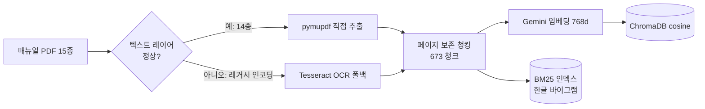
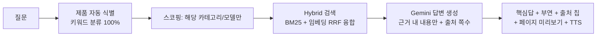

# 매뉴얼 음성 도우미 (manualgo) 🎙️

> **"세탁기 예약은 최대 몇 시간까지 돼?"** — 폰에 대고 물으면, 매뉴얼을 검색해
> **근거 페이지와 함께** 음성으로 답하는 핸즈프리 RAG 시스템

가전이 갑자기 멈추면 사람들은 수십 쪽짜리 PDF 매뉴얼 대신 폰을 듭니다.
이 프로젝트는 그 순간 — *양손은 기기를 만지고 있고, 답은 매뉴얼 어딘가에 있는* — 을 위해 만들었습니다.

매뉴얼은 **"이 질문의 정답은 몇 페이지"가 명확한 도메인**입니다.
그래서 이 프로젝트의 핵심은 챗봇 그 자체가 아니라, **검색 품질을 수치로 진단하고 → 개선하고 → 재측정하는 루프**입니다.

---

## 📊 핵심 결과 한눈에

| 지표 | 결과 | 비고 |
|---|---|---|
| 검색 정확도 (제품 식별 시) | **R@1 0.71 · R@5 0.96 · MRR 0.82** | 52문항, (매뉴얼, 페이지) 단위 정답 |
| 검색기 개선 폭 | Naive 0.39 → **Hybrid 0.55 (+41%)** → 스코핑 0.71 | 동일 평가셋 3단계 비교 |
| 제품 자동 식별 (Agentic) | **52/52 (100%)** | 질문 텍스트만으로 카테고리 분류 |
| 환각률 (LLM-as-judge) | **0/7 검출** · 인용 정확 7/7 | 소표본 스폿체크 |
| 코퍼스 | 매뉴얼 15종 · 673청크 (~570쪽) | LG 14 + 삼성 1, 7개 카테고리 |

---

## 데모 흐름

```
 제품 선택(칩)  →  🎙️ 음성 질문  →  근거 검색  →  핵심 답 + 출처 칩  →  📄 출처 페이지 미리보기
 (안 골라도 됨:      브라우저 STT       Hybrid+스코핑     "최대 24시간"          실제 매뉴얼 페이지가
  질문에서 자동 식별)                                  + Azure 음성 재생        그대로 뜸 + 탭하면 확대
```

- **출처가 UI의 중심**입니다 — 답변마다 근거 페이지 번호 칩이 붙고, 탭하면 실제 매뉴얼
  페이지 이미지가 바텀시트로 올라옵니다. *환각인지 아닌지 사용자가 직접 검증할 수 있습니다.*
- STT는 브라우저 Web Speech(무료·클라이언트), TTS는 Azure 뉴럴 보이스(폴백: 브라우저 TTS).

---

## 아키텍처

**① 오프라인 인덱싱 (사전 1회)**



**② 온라인 추론 (질문마다)**



---

## 🔬 엔지니어링 스토리 — 진단 → 개선 → 재측정

이 프로젝트에서 가장 공들인 부분입니다. 모든 개선은 **같은 평가셋으로 전후를 측정**해 입증했습니다.

### 1. 현실의 PDF는 깨져 있었다 → 파서 우선 + OCR 자동 폴백

수집한 매뉴얼 중 삼성 구형 PDF는 레거시 한국어 인코딩(KSCpc-EUC)이라 텍스트 추출 시
`쟔뫎럎뫐` 같은 깨진 글자만 나왔습니다. **텍스트 레이어 정상 여부를 자동 감지**해
정상이면 직접 추출, 깨졌으면 Tesseract OCR로 폴백하는 인제스트를 만들었습니다.

| (동일 평가셋) | OCR 전용 | 파서 우선 |
|---|---|---|
| 사양·수치형 R@1 | 0.263 | **0.368** |
| 사양·수치형 R@5 | 0.579 | **0.789** |
| 전체 R@5 | 0.705 | **0.818** |

→ OCR 숫자 노이즈(`24시간→7시간`)가 수치형 질문을 망친다는 가설이 수치로 확인됐습니다.

### 2. 검색기 3단계 비교 — 융합이 단독을 이긴다

| 검색기 (R@1 / MRR) | 결과 | 관찰 |
|---|---|---|
| Naive (임베딩 단독) | 0.386 / 0.558 | 베이스라인 |
| BM25 (키워드 단독) | 0.341 / 0.511 | 사용법형에서 무너짐 (0.20) |
| **Hybrid (RRF 융합)** | **0.545 / 0.645** | **전 유형 1위, +41%** |

BM25는 전체로는 Naive보다 약하지만 문제해결형에선 더 강했고,
RRF 융합이 **두 검색기의 강점만 취해** 모든 유형에서 단독을 능가했습니다.
*(개선 전 44문항 평가셋 기준 — 세 검색기를 같은 조건에서 비교한 상대 수치입니다.)*

### 3. 실패 클러스터링 → "교차-매뉴얼 혼동" 발견 → 스코핑으로 해결

점수만 내지 않고 **틀린 질문을 유형별로 클러스터링**했습니다. 주요 실패 모드:
보증·부품보유기간 같은 **법정 고지 문구가 매뉴얼마다 거의 동일**해서, 맞는 *종류*의
페이지를 **틀린 매뉴얼**에서 가져오는 것. → 검색을 제품 단위로 좁히는 **스코핑**을 구현했습니다.

| Hybrid (52문항) | R@1 | R@5 | MRR |
|---|---|---|---|
| 글로벌 (스코핑 없음) | 0.462 | 0.827 | 0.620 |
| 카테고리 스코핑 | 0.568 | 0.886 | 0.690 |
| **매뉴얼 스코핑 (제품 식별 시)** | **0.712** | **0.962** | **0.816** |

→ *핵심 검색은 강했고, 낮은 글로벌 수치는 스코핑 부재 탓*임이 증명됐습니다.
Agentic 검색기가 질문에서 제품을 자동 분류(52/52)해 이 이득을 **사용자 입력 없이** 회수합니다.

### 4. 평가 인플레를 스스로 발견하고 수치를 깎았다

초기 자동 생성 평가셋은 본문이 긴 페이지를 선호해 **보증/보상 페이지 질문이 과대표집**돼
있었고, 점수가 부풀려져 있었습니다(스코핑 R@1 0.82). 보일러플레이트 제외 + 페이지 분산
샘플링으로 재생성하자 **0.71로 내려갔고, 이쪽이 정직한 수치**입니다.
*좋아 보이는 숫자보다 신뢰할 수 있는 숫자를 선택했습니다.*

### 5. 답변 품질 — 검색만이 아니라 생성도 측정

LLM-as-judge로 실서비스 경로의 답변을 3축 채점했습니다 (충실성 / 인용 정확성 / 정답성).

- **환각 0/7 검출, 인용 정확 7/7**, 정답 페이지 일치 5/7
- "오답" 2건도 지어낸 것이 아니라 **근거는 있으나 쌍둥이 모델의 매뉴얼 기반** —
  실패 클러스터링에서 발견한 코퍼스 모호성이 답변 레벨에서 재확인된 것

> ⚠️ 소표본(n=7) 스폿체크이며 심판이 생성기와 같은 모델 계열입니다.
> "환각 0% 확정"이 아니라 "7건에서 미검출"이 정확한 표현입니다.

---

## 기술 스택 (실제 사용)

| 영역 | 기술 | 선택 이유 |
|---|---|---|
| 문서 처리 | PyMuPDF + Tesseract(kor) | 텍스트 레이어 자동 감지, 깨지면 OCR 폴백 |
| 임베딩 | Gemini `embedding-001` (768d) | Windows에서 torch 스택이 크래시 → API로 우회 |
| 키워드 검색 | rank-bm25 + **한글 바이그램 토크나이저** | 띄어쓰기 없는 추출 텍스트 대응 |
| 융합 | Reciprocal Rank Fusion (k=60) | 점수 정규화 불필요, 안정적 |
| 벡터 DB | ChromaDB (cosine, 영속) | 메타 필터로 스코핑 (`manual_id $in`) |
| LLM | Gemini 2.5 Flash | 근거 제한 프롬프트 + JSON 구조화 답변 |
| STT / TTS | 브라우저 Web Speech / **Azure Speech** (REST) | 클라이언트 STT 무료, TTS는 뉴럴 보이스+폴백 |
| 백엔드 / 프론트 | FastAPI / Vanilla JS (모바일 우선) | `/ask` `/manuals` `/tts` `/page` |

**제약 대응기**: 이 프로젝트는 Windows + 6GB GPU + 무료 API 쿼터라는 제약에서 만들어졌습니다.
`sentence-transformers` import가 무음 크래시 → 임베딩을 API로 전환, Gemini 무료
`generate_content` 20회/일 → OCR을 로컬 Tesseract로 이전하고 평가는 임베딩 쿼터(별도)만
쓰도록 설계, 대량 호출엔 백오프·재시도·부분저장·이어하기를 붙였습니다.

---

## 실행 방법

```bash
# 0. 사전 준비: Python 3.11, Tesseract(한국어 데이터 포함) 설치
pip install -r requirements.txt
pip install -e .

# 1. 환경 변수
cp .env.example .env       # GOOGLE_API_KEY, TESSERACT_CMD, AZURE_SPEECH_* 채우기

# 2. 매뉴얼 수집 + 인덱스 구축 (사전 1회)
python scripts/collect_manuals.py          # data/raw/manual_urls.txt 의 직링크 다운로드
python -m rag.indexing.build_index         # 파싱(파서/OCR 자동) → 임베딩 → ChromaDB

# 3. 웹앱 실행 → Chrome에서 http://localhost:8000
uvicorn backend.main:app --reload

# 4. 평가 (포트폴리오 핵심)
python -m evaluation.generate_evalset      # 평가셋 자동 생성 (+ scripts/review_evalset.py 로 검수)
python -m evaluation.run_eval hybrid       # Recall@k·MRR  [naive|bm25|hybrid|agentic] [manual|category]
python -m evaluation.failure_clustering    # 실패 유형 분석
python -m evaluation.answer_quality 8      # 환각률·인용 정확성 (LLM-as-judge)
```

---

## 프로젝트 구조

```
manualgo/
├─ rag/               # RAG 코어
│  ├─ indexing/       #   파서 우선 + OCR 폴백 인제스트, 청킹, 임베딩, 인덱스 구축
│  ├─ retrieval/      #   naive / bm25 / hybrid(RRF) / agentic(제품 자동식별) + 스코핑
│  ├─ generation/     #   근거 제한 답변 생성 (headline + 부연 + 출처)
│  └─ vectorstore/    #   ChromaDB 래퍼 (메타 필터)
├─ evaluation/        # 평가 모듈 ⭐
│  ├─ generate_evalset.py   #   평가셋 자동생성 (보일러플레이트 제외·유형 분산)
│  ├─ run_eval.py            #   Recall@k·MRR, 검색기·스코프 비교
│  ├─ failure_clustering.py  #   실패 유형/매뉴얼별 클러스터링
│  └─ answer_quality.py      #   LLM-as-judge (환각·인용·정답성)
├─ backend/           # FastAPI — /ask /manuals /tts /page + 정적 서빙
├─ frontend/          # 모바일 웹앱 — 음성 상태머신, 출처 칩→페이지 미리보기→라이트박스
├─ speech/            # Azure TTS (REST)
├─ scripts/           # 매뉴얼 수집, 평가셋 검수, 인덱스 점검
└─ data/              # 매뉴얼 PDF / 평가셋 / 벡터 DB (git 제외)
```

---

## 한계와 다음 단계

**정직한 한계**
- 평가셋 52문항·자동 생성(일부 검수) — 유형별 수치는 방향 지표이며 신뢰구간이 넓음
- 환각 측정은 n=7 스폿체크 + 자기심판(같은 모델 계열) 편향 가능
- Cross-Encoder Reranker 미적용 (Windows torch 제약 → 배포 서버에서 적용 예정)
- 레이턴시 미측정, 멀티턴 대화 미지원

**다음 단계**
- [ ] Reranker (ONNX or 리눅스 서버) — top-1 정밀도 추가 상승
- [ ] ColPali/ColQwen2 비전 검색과 비교 실험 (Colab) — 텍스트 vs 비전 검색 ablation
- [ ] 답변 품질 n 확대 + 타 모델 심판으로 이원화
- [ ] 레이턴시 계측, 배포 (Linux — 로컬 임베딩/리랭커 복귀 옵션)

---

## 데이터 관련

매뉴얼 PDF는 제조사 공식 사이트에서 수집한 저작물로 **개인 학습·연구용으로만 로컬 인덱싱**했으며
저장소에는 포함하지 않습니다 (`data/` gitignore). 초기 기획은 [docs/planning.md](docs/planning.md) 참고.
