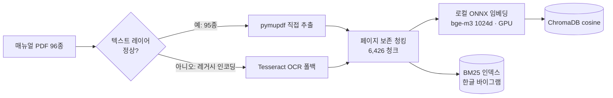
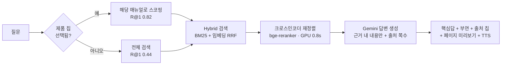

# 매뉴얼 음성 도우미 (manualgo) 🎙️

> **"세탁기 예약은 최대 몇 시간까지 돼?"** — 폰에 대고 물으면, 매뉴얼을 검색해
> **근거 페이지와 함께** 음성으로 답하는 핸즈프리 RAG 시스템

가전이 갑자기 멈추면 사람들은 수십 쪽짜리 PDF 매뉴얼 대신 폰을 듭니다.
이 프로젝트는 그 순간 — *양손은 기기를 만지고 있고, 답은 매뉴얼 어딘가에 있는* — 을 위해 만들었습니다.

매뉴얼은 **"이 질문의 정답은 몇 페이지"가 명확한 도메인**입니다.
그래서 이 프로젝트의 핵심은 챗봇 그 자체가 아니라, **검색 품질을 수치로 진단하고 → 개선하고 → 재측정하는 루프**입니다.

---

## 📊 핵심 결과 한눈에

| 지표 | 결과 | 비고 |
|---|---|---|
| 검색 정확도 (제품 선택 시) | **R@1 0.820 · R@5 0.980 · MRR 0.889** | 640문항, (매뉴얼, 페이지) 단위 정답 |
| 검색 정확도 (제품 미선택) | R@1 0.442 · R@5 0.781 · MRR 0.581 | 96종 전체를 대상으로 검색 |
| ⚠️ **실사용자 말투로 물으면** | **R@1 0.495 · R@5 0.815** (제품 선택 시) | 같은 정답, 표현만 구어체 → **−32pp** (§10) |
| 리랭커 A/B | **4개 스코프 전부 유의** (R@1 +5.6~7.7pp) | paired bootstrap CI · McNemar p ≤ 0.003 |
| 라이브 지연 (실측) | 검색+재정렬 **0.9s** · 생성 **1.85s** | 단계별 계측, 총 ~2.8s |
| 코퍼스 | 매뉴얼 **96종** · 6,426청크 (4,509쪽) | 8개 브랜드 · 18개 카테고리 |
| 임베딩 | 로컬 ONNX (bge-m3) — **API 쿼터 0** | 생성만 API, 검색·재정렬은 전부 로컬 |
| 환각률 (LLM-as-judge) | 0/7 검출 · 인용 정확 7/7 | 소표본 스폿체크 (재측정 필요 → §한계) |

---

## 데모 흐름

```
 제품 선택(칩)  →  🎙️ 음성 질문  →  근거 검색  →  핵심 답 + 출처 칩  →  📄 출처 페이지 미리보기
 (안 골라도 됨:      브라우저 STT     Hybrid+재정렬      "최대 24시간"          실제 매뉴얼 페이지가
  전체에서 검색)                                      + Azure 음성 재생        그대로 뜸 + 탭하면 확대
```

- **출처가 UI의 중심**입니다 — 답변마다 근거 페이지 번호 칩이 붙고, 탭하면 실제 매뉴얼
  페이지 이미지가 바텀시트로 올라옵니다. *환각인지 아닌지 사용자가 직접 검증할 수 있습니다.*
- STT는 브라우저 Web Speech(무료·클라이언트), TTS는 Azure 뉴럴 보이스(폴백: 브라우저 TTS).

---

## 아키텍처

**① 오프라인 인덱싱 (사전 1회)**



**② 온라인 추론 (질문마다)**



---

## 🔬 엔지니어링 스토리 — 진단 → 개선 → 재측정

이 프로젝트에서 가장 공들인 부분입니다. 모든 개선은 **같은 평가셋으로 전후를 측정**해 입증했고,
효과 크기는 **신뢰구간과 함께** 봅니다.

### 1. 현실의 PDF는 깨져 있었다 → 파서 우선 + OCR 자동 폴백

수집한 매뉴얼 중 삼성 구형 PDF는 레거시 한국어 인코딩(KSCpc-EUC)이라 텍스트 추출 시
`쟔뫎럎뫐` 같은 깨진 글자만 나왔습니다. **텍스트 레이어 정상 여부를 자동 감지**해
정상이면 직접 추출, 깨졌으면 Tesseract OCR로 폴백하는 인제스트를 만들었습니다.

| (동일 평가셋) | OCR 전용 | 파서 우선 |
|---|---|---|
| 사양·수치형 R@1 | 0.263 | **0.368** |
| 사양·수치형 R@5 | 0.579 | **0.789** |
| 전체 R@5 | 0.705 | **0.818** |

→ OCR 숫자 노이즈(`24시간→7시간`)가 수치형 질문을 망친다는 가설이 수치로 확인됐습니다.
이 자동 판정은 96종으로 늘린 뒤에도 그대로 작동해, OCR이 필요한 쪽은 **4,509쪽 중 139쪽(3%)** 뿐입니다.

### 2. 검색기 3단계 비교 — 융합이 단독을 이긴다

| 검색기 (640문항, 글로벌) | R@1 | R@5 | MRR |
|---|---|---|---|
| Naive (임베딩 단독) | 0.319 | 0.622 | 0.446 |
| BM25 (키워드 단독) | 0.345 | 0.675 | 0.484 |
| **Hybrid (RRF 융합)** | **0.372** | **0.705** | **0.514** |

임베딩과 BM25는 서로 다른 유형에서 강했고, RRF 융합이 **두 검색기의 강점만 취해**
전 지표에서 단독을 앞섰습니다. 추출 텍스트에 띄어쓰기가 없어 BM25 토크나이저는
**한글 문자 바이그램**으로 직접 만들었습니다.

> ⚠️ **이 결론은 나중에 반쯤 뒤집혔습니다.** §10에서 실사용자 말투로 다시 물어보니
> 융합의 이득이 사라졌습니다(+6.0pp → −1.0pp, 미유의). BM25가 강해 보였던 건
> 평가셋 질문이 정답 페이지의 단어를 그대로 쓰고 있었기 때문입니다.

### 3. 실패 클러스터링 → "교차-매뉴얼 혼동" 발견 → 스코핑으로 해결

점수만 내지 않고 **틀린 질문을 유형별로 클러스터링**했습니다. 주요 실패 모드:
보증·부품보유기간 같은 **법정 고지 문구가 매뉴얼마다 거의 동일**해서, 맞는 *종류*의
페이지를 **틀린 매뉴얼**에서 가져오는 것. → 검색을 제품 단위로 좁히는 **스코핑**을 구현했습니다.

| Hybrid (640문항) | R@1 | R@5 | MRR |
|---|---|---|---|
| 글로벌 (스코핑 없음) | 0.372 | 0.705 | 0.514 |
| 카테고리 스코핑 | 0.412 | 0.750 | 0.555 |
| **매뉴얼 스코핑 (제품 선택 시)** | **0.744** | **0.950** | **0.829** |

→ **정확한 제품을 알면 R@1이 0.37 → 0.74로 두 배**가 됩니다. 핵심 검색은 강했고,
낮은 글로벌 수치는 96종 사이의 혼동 탓이었습니다. 그래서 UI는 제품 칩 탭을 1급 경로로 둡니다.

### 4. 평가 인플레를 스스로 발견하고 수치를 깎았다

초기 자동 생성 평가셋은 본문이 긴 페이지를 선호해 **보증/보상 페이지 질문이 과대표집**돼
있었고, 점수가 부풀려져 있었습니다(스코핑 R@1 0.82). 보일러플레이트 제외 + 페이지 분산
샘플링으로 재생성하자 **0.71로 내려갔고, 이쪽이 정직한 수치**입니다.
*좋아 보이는 숫자보다 신뢰할 수 있는 숫자를 선택했습니다.* 이후 검정력 확보를 위해
같은 원칙으로 **640문항**까지 확장했습니다(§6).

### 5. 답변 품질 — 검색만이 아니라 생성도 측정

LLM-as-judge로 실서비스 경로의 답변을 3축 채점했습니다 (충실성 / 인용 정확성 / 정답성).

- **환각 0/7 검출, 인용 정확 7/7**, 정답 페이지 일치 5/7
- "오답" 2건도 지어낸 것이 아니라 **근거는 있으나 쌍둥이 모델의 매뉴얼 기반** —
  실패 클러스터링에서 발견한 코퍼스 모호성이 답변 레벨에서 재확인된 것

> ⚠️ 소표본(n=7) 스폿체크이며 심판이 생성기와 같은 모델 계열입니다.
> "환각 0% 확정"이 아니라 "7건에서 미검출"이 정확한 표현입니다.

### 6. 리랭커: 통계가 "아직 배포하지 마라"고 했고, 나중엔 "이제 해도 된다"고 했다

top-1 정밀도를 끌어올릴 가장 큰 레버는 **Cross-Encoder Reranker**입니다. Windows torch
크래시 제약을 **ONNX**로 우회해 `bge-reranker-v2-m3`를 붙였고, **"붙였다"로 끝내지 않고**
같은 평가셋으로 전후를 측정했습니다.

**1차 판정 (151문항) — 보류.** R@1 +9.6pp에 리랭커 승률 78%로, 점추정만 보면 "채택!"이라
쓸 뻔했습니다. 하지만 **페어드 부트스트랩 신뢰구간이 0을 포함**하고 McNemar p=0.18이었습니다.
검정력 분석은 이 효과를 확증하려면 **540~850문항**이 필요하다고 알려줬습니다.

**2차 판정 (640문항) — 채택.** 평가셋을 4배로 늘리자 결론이 났습니다.

| A/B (640문항) | R@1 | Δ | 95% CI (paired bootstrap) | McNemar |
|---|---|---|---|---|
| 제품 선택 (매뉴얼 스코프) | 0.744 → **0.820** | +7.7pp | [+0.047, +0.106] | 72:23, **p<0.0001** |
| 제품 미선택 (글로벌) | 0.372 → **0.442** | +7.0pp | [+0.034, +0.106] | 94:49, p=0.0002 |
| 카테고리 스코프 | 0.412 → **0.469** | +5.6pp | [+0.020, +0.092] | 88:52, p=0.0030 |
| 자동 스코핑 | 0.359 → **0.423** | +6.4pp | [+0.030, +0.098] | 87:46, p=0.0005 |

**R@3·R@5·MRR까지 16개 비교 전부 유의**(모든 CI가 0을 넘지 않음).

> **왜 1차에서 못 잡았나.** 소표본에서 리랭커 승률이 62%로 보였는데 640문항에서는 **76%**였습니다.
> 효과는 원래 강했지만 n=151로는 그 강도를 신뢰할 수 없었던 것입니다. *점추정을 믿었다면
> 1차에서 과대 주장을, CI만 보고 포기했다면 진짜 개선을 버렸을 것입니다.*

### 7. 코퍼스를 6.4배로 늘리자 숨어 있던 결함 3개가 드러났다

15종에서 잘 돌던 것들이 96종에서 무너졌습니다. **확장하지 않았다면 영원히 몰랐을 문제들**입니다.

**① 인덱싱이 끝에서 반드시 실패하는 상태였다.** ChromaDB는 `add()` 1회당 **5,461레코드** 상한이
있는데 6,426청크를 한 번에 쓰고 있었습니다. 게다가 `reset()`이 먼저 실행돼 **실패하면 컬렉션이
빈 채로 남는** 구조였습니다. → 배치 분할 + **임시 컬렉션에 다 쓴 뒤 이름 교체**로 바꿨습니다.

**② 키워드 분류기가 규모를 못 따라갔다.** 15종에서 92.7%였던 카테고리 분류가 96종에서
**52.8%로 붕괴**했습니다. 질문 키워드가 8개 카테고리만 알았고, `manual_category`가 새 파일명
(TV·의류관리기·건조기·공기청정기·밥솥 등)을 몰라 다수를 `etc`로 뭉개고 있었습니다.
→ 18개 카테고리로 확장해 **75.9%**로 회복(미분류 0종).

**③ "똑똑한" 자동 스코핑이 오히려 손해였다.** 분류 76% 조건에서 자동 카테고리 스코핑은
글로벌 검색보다 **유의하게 나빴습니다**(R@1 0.423 vs 0.442, CI[+0.002,+0.036]).
원인은 **위험의 비대칭성** — 카테고리를 틀리면 정답 매뉴얼이 후보에서 아예 배제돼 확정 실패인데,
맞혀도 이득은 "범위가 좁아지는" 정도입니다. → **라이브에서 자동 스코핑을 제거**하고
칩 선택 시 매뉴얼 스코프 / 미선택 시 글로벌로 단순화했습니다.
(코드는 평가용으로 남겨 뒀습니다 — 음성 결과도 자산입니다.)

### 8. 쿼터 벽 → 로컬 ONNX 임베딩으로 자립, 그리고 GPU의 함정

Gemini 무료 임베딩은 **배치를 써도 텍스트 1건 = 1요청**으로 과금돼 하루 1,000건이 상한입니다.
6,426청크 인덱싱에 **6.4일**이 필요해 확장이 막혔습니다. 리랭커에서 검증한 ONNX 경로로
임베딩을 로컬화(`bge-m3`, 1024d)해 **쿼터를 없앴습니다.**

| 실측 (GTX 1660 SUPER · DirectML) | CPU int8 | GPU fp16 | **GPU fp32** |
|---|---|---|---|
| 임베더 처리량 | 1.8 청크/초 | (로드 실패) | **24.7 청크/초** |
| 리랭커 20후보 재정렬 | 8,359ms | 6,635ms | **1,201ms** |
| 6,426청크 인덱싱 | 58분 | — | **~4분** |

> **GPU를 켜도 자동으로 빨라지지 않는다.** 처음엔 "GPU엔 fp16이 유리하다"는 관례를 따랐고
> **21%만** 빨라져 GPU를 포기할 뻔했습니다. 원인은 이 GPU(Turing TU116)에 **텐서코어가 없어**
> fp16 이득이 없고 DirectML의 fp16 경로가 오히려 느린 것이었습니다. fp32로 바꾸자 **5.5배**
> 더 빨라졌습니다. 하드웨어 특성을 모르고 관례를 따르면 성능의 82%를 잃습니다.

VRAM 6GB에 두 모델을 동시에 올리면 여유가 294MiB뿐이라 **오히려 1.7배 느려졌습니다**(스래싱).
그래서 컴포넌트별 provider를 나눠 **리랭커만 GPU, 임베더는 CPU**로 둡니다(짧은 질의 1건은
CPU에서 78ms). 임베딩 모델·차원·양자화를 **컬렉션 메타데이터에 기록**해 다른 구성으로
검색하면 경고합니다 — int8 인덱스에 fp32 질의를 던지는 실수를 실제로 이 장치가 잡아냈습니다.

### 9. 단계별 지연 계측 — 엉뚱한 곳을 최적화하고 있었다

음성 UX 목표는 총 3초입니다. 리랭커를 8.4s → 0.8s로 줄이고 뿌듯해하다가,
**단계별로 재보니 생성이 전체의 81%** 였습니다.

| 단계 (실측 평균) | 이전 | 개선 후 |
|---|---|---|
| 검색 + 재정렬 | 1,129ms | **907ms** (후보 20→10) |
| 답변 생성 | 4,872ms | **1,849ms** (thinking 끔) |
| **총** | **6,002ms** | **~2,800ms** |

- **생성**: Gemini 2.5 Flash는 기본으로 thinking이 켜져 있습니다. 이 작업은 "근거에 적힌 값을
  찾아 옮기는" 추출형이라 추론 예산 이득이 적어 `THINKING_BUDGET=0`으로 끄자 **2.6배** 빨라졌습니다.
- **재정렬 후보 수**: 20 → 10으로 줄여 지연을 절반으로(1,483 → 772ms). R@1 차이가
  **유의하지 않아서**(0.820 vs 0.816, p=0.25) 라이브에는 10을 씁니다. R@3·R@5는 20이 조금 우세해
  오프라인 평가는 20으로 보고합니다.

*"측정하지 않으면 가장 눈에 띄는 것을 최적화하게 된다"* 는 걸 직접 겪었습니다.

### 10. 내 평가셋을 의심하고, 그 낙관 편향을 직접 측정했다

여기까지의 모든 수치에는 공통된 약점이 있습니다. **평가셋을 LLM이 '정답 페이지를 보고' 만들었다는 것.**
그래서 질문이 그 페이지의 단어를 그대로 재사용하고, 어휘 매칭에 유리하게 편향됩니다.
*실제 사용자는 매뉴얼 용어로 말하지 않습니다.*

| | 질문 |
|---|---|
| 평가셋(문서 유래) | "스테인레스 세탁조에 녹이 발생할 수 있는 경우는 어떤 때인가요?" |
| 실사용자 | "통돌이 세탁기 통에 녹 슬 수 있는 게 어떤 경우예요?" |

**실험 설계**: 표본 200문항의 **정답(매뉴얼, 페이지)은 그대로 두고 표현만 구어체로** 재작성했습니다.
같은 순서·같은 정답이라 완전히 짝지은 비교가 되고, 두 점수의 차이가 곧 편향의 크기입니다.
정보 요구를 흐리지 않는 것(숫자를 묻던 건 계속 숫자를 묻기)이 실험의 핵심 통제였고,
**조작이 실제로 일어났는지 코드로 검증**했습니다 — 질문 바이그램이 정답 페이지에 등장하는 비율이
**47.0% → 18.2%** (200문항 중 197건에서 감소).

**결과 — 내 수치는 크게 낙관적이었습니다.**

| 검색기 (200문항 · 짝지은 비교) | 문서 유래 | 실사용자 | Δ R@1 | 상대 |
|---|---|---|---|---|
| BM25 (키워드) | 0.390 | **0.025** | −36.5pp | **−94%** |
| Naive (임베딩) | 0.355 | 0.120 | −23.5pp | −66% |
| Hybrid (RRF) | 0.415 | 0.110 | −30.5pp | −73% |
| Hybrid + 매뉴얼 스코프 | 0.740 | 0.320 | −42.0pp | −57% |
| **리랭커 + 매뉴얼 (라이브)** | **0.815** | **0.495** | **−32.0pp** | −39% |

라이브 경로 저하는 McNemar **68:4, p<0.0001**로 압도적으로 유의합니다.

**이 실험이 밝혀낸 3가지**

**① 어휘 편향이 실재하고, 그 메커니즘까지 확인됐다.** 편향이 원인이라면 키워드 검색이 가장 크게
무너져야 한다고 예측했고, 실제로 BM25가 **−94%로 사실상 붕괴**했습니다(임베딩은 −66%).
BM25는 실력이 아니라 **질문이 정답 페이지의 단어를 빌려준 덕**에 점수를 받고 있었습니다.

**② "융합이 단독을 이긴다"는 결론이 편향의 산물이었다.** 문서 유래 질문에서는 Hybrid가 Naive를
유의하게 앞섰지만(+6.0pp, R@3 +12.5pp), 실사용자 질문에서는 **이득이 사라졌습니다**(−1.0pp, 미유의).

**③ 반대로 리랭커는 과소평가되고 있었다.** 크로스인코더의 이득이 문서 유래에서 +7.5pp였는데
실사용자 질문에서는 **+17.5pp**(McNemar 49:14, p<0.0001)로 **두 배 이상** 커집니다.
질의와 문서가 어휘를 공유하지 않을 때 (질문, 청크) 쌍을 함께 읽는 크로스인코더의 값어치가 드러납니다.
*편향된 평가셋은 BM25를 과대평가하고 리랭커를 과소평가하고 있었습니다.*

> **정직한 현재 성능.** 실사용자 말투 기준으로, 제품을 고르면 정답 페이지가 top-5에 **81.5%**,
> 안 고르면 **41.5%** 들어옵니다. 앞의 표들(640문항)은 **상대 비교용**으로는 유효하지만
> **절대 성능의 상한**으로 읽어야 합니다.

---

## 기술 스택 (실제 사용)

| 영역 | 기술 | 선택 이유 |
|---|---|---|
| 문서 처리 | PyMuPDF + Tesseract(kor) | 텍스트 레이어 자동 감지, 깨지면 OCR 폴백 |
| 임베딩 | **ONNX `bge-m3`** (1024d, 로컬) | torch 크래시 우회 + API 쿼터 0. Gemini API로도 전환 가능 |
| 키워드 검색 | rank-bm25 + **한글 바이그램 토크나이저** | 띄어쓰기 없는 추출 텍스트 대응 |
| 융합 | Reciprocal Rank Fusion (k=60) | 점수 정규화 불필요, 안정적 |
| 재순위 | **ONNX `bge-reranker-v2-m3`** (GPU) | R@1 +7.7pp(유의) · 0.8s — 라이브 탑재 |
| 벡터 DB | ChromaDB (cosine, 영속) | 메타 필터로 스코핑 (`manual_id $in`) |
| LLM | Gemini 2.5 Flash (thinking 0) | 근거 제한 프롬프트 + JSON 구조화 답변 |
| STT / TTS | 브라우저 Web Speech / **Azure Speech** (REST) | 클라이언트 STT 무료, TTS는 뉴럴 보이스+폴백 |
| 백엔드 / 프론트 | FastAPI / Vanilla JS (모바일 우선) | `/ask` `/manuals` `/tts` `/page` |

**제약 대응기**: 이 프로젝트는 Windows + 6GB GPU + 무료 API 쿼터라는 제약에서 만들어졌습니다.
`sentence-transformers` import가 무음 크래시 → **ONNX 런타임으로 임베딩·재정렬을 로컬화**,
Gemini 무료 `generate_content` 20회/일 → OCR을 로컬 Tesseract로 이전하고 평가셋 생성은 배치로
묶어 14회에 640문항, 임베딩은 쿼터 자체를 제거. 반복 호출엔 백오프·재시도·부분저장·이어하기와
**디스크 캐시**를 붙였습니다.

---

## 실행 방법

```bash
# 0. 사전 준비: Python 3.11, Tesseract(한국어 데이터 포함) 설치
pip install -r requirements.txt
pip install -e .

# 1. 환경 변수
cp .env.example .env       # GOOGLE_API_KEY, TESSERACT_CMD, AZURE_SPEECH_* 채우기

# 2. 매뉴얼 수집 + 인덱스 구축 (사전 1회)
python scripts/probe_manual_urls.py        # (선택) 받기 전 %PDF·용량 검증
python scripts/collect_manuals.py          # data/raw/manual_urls.txt 의 직링크 다운로드
python scripts/check_corpus.py             # (선택) 텍스트 레이어·OCR 비용 미리보기
python -m rag.indexing.build_index         # 파싱(파서/OCR 자동) → 임베딩 → ChromaDB

# 3. 웹앱 실행 → Chrome에서 http://localhost:8000
uvicorn backend.main:app --reload
```

**주요 환경 변수**

| 변수 | 기본 | 뜻 |
|---|---|---|
| `EMBED_BACKEND` | `gemini` | `onnx`=로컬 bge-m3(권장) / `gemini`=API. 컬렉션이 함께 바뀝니다 |
| `EMBED_CACHE` | `0` | `1`이면 임베딩 디스크 캐시 (재실행·재평가가 즉시) |
| `ONNX_PROVIDER` | `auto` | `cpu`/`cuda`/`dml`. `_EMBED`/`_RERANK` 접미사로 컴포넌트별 지정 |
| `ONNX_WEIGHTS` | 자동 | 가중치 고정(`model.onnx` 등) — 인덱스와 양자화를 맞출 때 |
| `RERANK` / `RERANK_POOL` | `1` / `10` | 리랭커 사용 여부 / 재정렬 후보 수 |
| `THINKING_BUDGET` | `0` | 생성 추론 예산. `-1`=자동(느리지만 신중) |

```bash
# 4. 평가 (포트폴리오 핵심)
export EMBED_BACKEND=onnx EMBED_CACHE=1
python -m evaluation.generate_evalset --append   # 평가셋 증분 확장 (+ scripts/review_evalset.py)
python -m evaluation.run_eval hybrid manual      # [naive|bm25|hybrid|agentic|rerank|agentic-rerank] [manual|category]
python -m evaluation.compare hybrid_manual__onnx rerank_manual__onnx   # A/B 유의성
python -m evaluation.report                      # 통합표 + 4쌍 A/B + 필요 표본 크기
python -m evaluation.failure_clustering          # 실패 유형 분석
python -m evaluation.answer_quality 8            # 환각률·인용 정확성 (LLM-as-judge)
python scripts/check_latency.py                  # 단계별 지연 (캐시 끄고 신규 질의)
```

---

## 프로젝트 구조

```
manualgo/
├─ rag/                # RAG 코어
│  ├─ onnx_runtime.py  #   ONNX provider·가중치 선택 (CPU/CUDA/DirectML)
│  ├─ indexing/        #   파서 우선 + OCR 폴백, 청킹, 임베딩(로컬/API), 백엔드 선택
│  ├─ retrieval/       #   naive / bm25 / hybrid(RRF) / agentic(평가용) / reranker(ONNX)
│  ├─ generation/      #   근거 제한 답변 생성 (headline + 부연 + 출처)
│  └─ vectorstore/     #   ChromaDB 래퍼 (배치 쓰기·안전 교체·모델 스탬프)
├─ evaluation/         # 평가 모듈 ⭐
│  ├─ generate_evalset.py   #   평가셋 자동생성·증분 확장 (보일러플레이트 제외)
│  ├─ run_eval.py            #   Recall@k·MRR, 검색기·스코프 비교
│  ├─ compare.py             #   A/B 유의성 — paired bootstrap CI·McNemar
│  ├─ report.py              #   통합표 + A/B + 필요 표본 크기(검정력)
│  ├─ failure_clustering.py  #   실패 유형/매뉴얼별 클러스터링
│  └─ answer_quality.py      #   LLM-as-judge (환각·인용·정답성)
├─ backend/            # FastAPI — /ask /manuals /tts /page + 정적 서빙
├─ frontend/           # 모바일 웹앱 — 음성 상태머신, 출처 칩→페이지 미리보기→라이트박스
├─ speech/             # Azure TTS (REST)
├─ scripts/            # 수집·검증(probe/corpus/index)·지연 측정·평가셋 검수
└─ data/               # 매뉴얼 PDF / 평가셋 / 벡터 DB / 캐시 (git 제외)
```

---

## 한계와 다음 단계

**정직한 한계**
- **평가셋이 낙관 편향돼 있고, 그 크기를 측정했습니다(§10): 실사용자 말투에서 R@1 −32pp.**
  640문항 표는 검색기 간 *상대 비교*로는 유효하지만 절대 성능으로 읽으면 안 됩니다.
  실사용자 기준 평가셋을 200문항밖에 못 만들었고(자동 재작성), 사람이 처음부터 쓴 질문은 아직 없습니다
- 평가셋 640문항·자동 생성(일부 검수) — 유형별 수치 중 `error_code`(n=9)는 표본이 너무 작음
- 환각 측정은 n=7 스폿체크 + 자기심판(같은 모델 계열) 편향 가능.
  **게다가 그 측정은 thinking on 조건이었고 현재 라이브는 thinking off**입니다 → 재측정 필요
- 자동 제품 분류 75.9% — 이 정확도로는 자동 스코핑이 손해라서 라이브에서 껐습니다.
  "제품을 안 골라도 알아서" 는 아직 미완성이고, 그게 정직한 상태입니다
- 리랭커는 GPU 전제(CPU에선 8.4s로 음성 UX 불가) → `RERANK=0` 폴백 제공
- 멀티턴 대화 미지원. 답변 스트리밍 미적용(체감 지연 개선 여지)

**다음 단계**
- [x] Cross-Encoder Reranker — 640문항에서 유의성 확인 후 라이브 탑재
- [x] 코퍼스 15→96종, 평가셋 151→640문항 (검정력 확보)
- [x] 로컬 ONNX 임베딩으로 쿼터 제거 + GPU 가속
- [x] 단계별 지연 계측 → 생성이 81%임을 발견하고 총 6.0s→2.8s
- [x] 평가셋 낙관 편향을 짝지은 실험으로 정량화 (−32pp) + 메커니즘 규명
- [ ] **실사용자 말투 평가셋을 1급 지표로 승격** — 200 → 640문항으로 확대하고 이걸 기준으로 재튜닝
      (BM25 가중치·RRF·리랭커 후보 수는 편향된 평가셋에 맞춰져 있을 가능성이 높음)
- [ ] thinking off 조건에서 환각률·인용 정확성 재측정 (n 확대 + 타 모델 계열 심판)
- [ ] 분류기 개선(임베딩 기반 분류 or 신뢰도 임계값) → 자동 스코핑을 이득으로 전환
- [ ] 답변 스트리밍으로 체감 지연 단축
- [ ] ColPali/ColQwen2 비전 검색 비교 실험 (Colab) — 텍스트 vs 비전 ablation

---

## 데이터 관련

매뉴얼 PDF는 제조사 공식 사이트에서 수집한 저작물로 **개인 학습·연구용으로만 로컬 인덱싱**했으며
저장소에는 포함하지 않습니다 (`data/` gitignore). 수집은 요청 간격을 두고 직링크만 받으며,
받기 전 `%PDF` 검증으로 뷰어/HTML 페이지를 걸러냅니다. 초기 기획은 [docs/planning.md](docs/planning.md) 참고.
